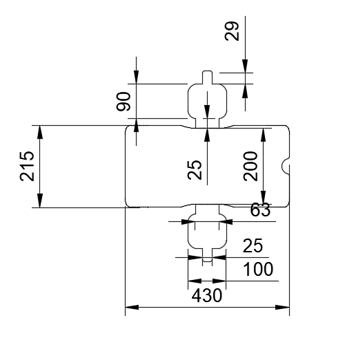
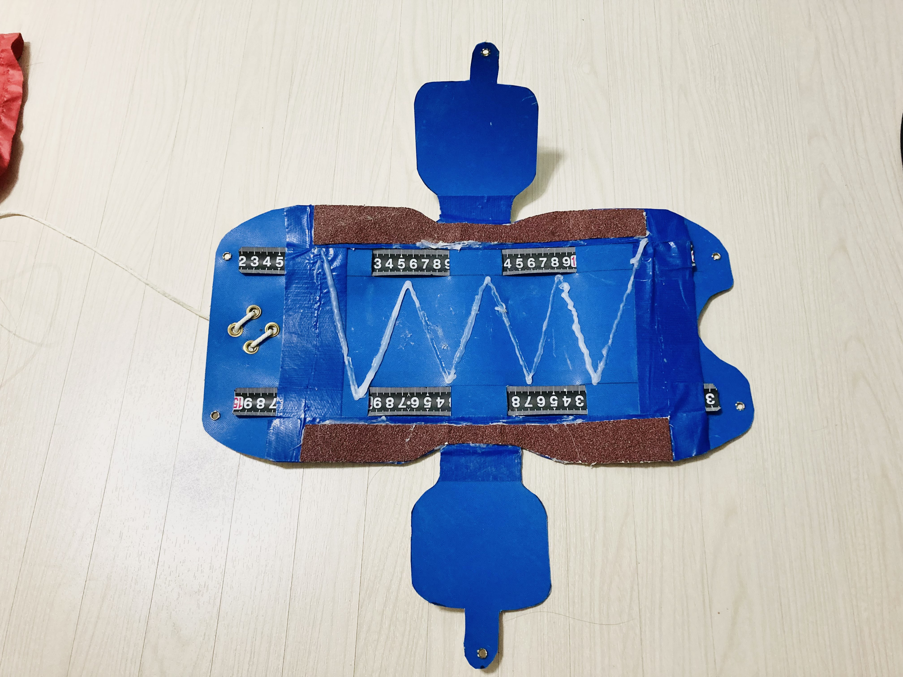
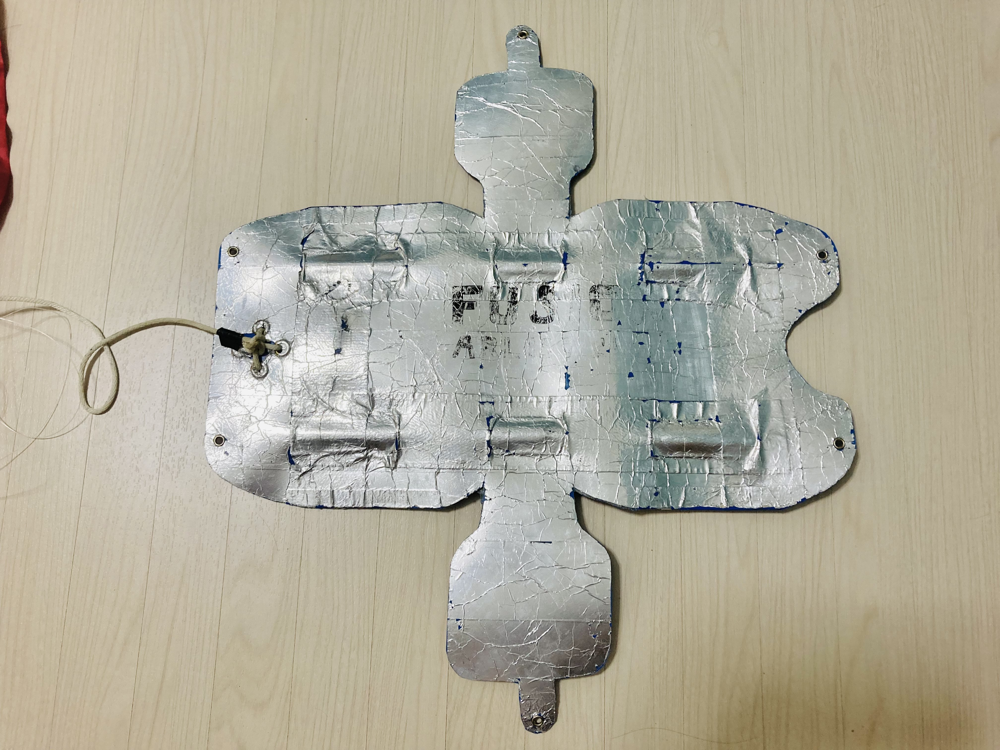
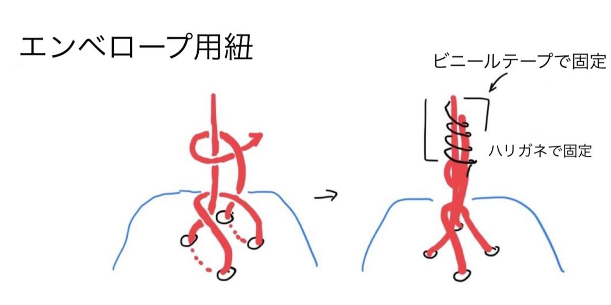
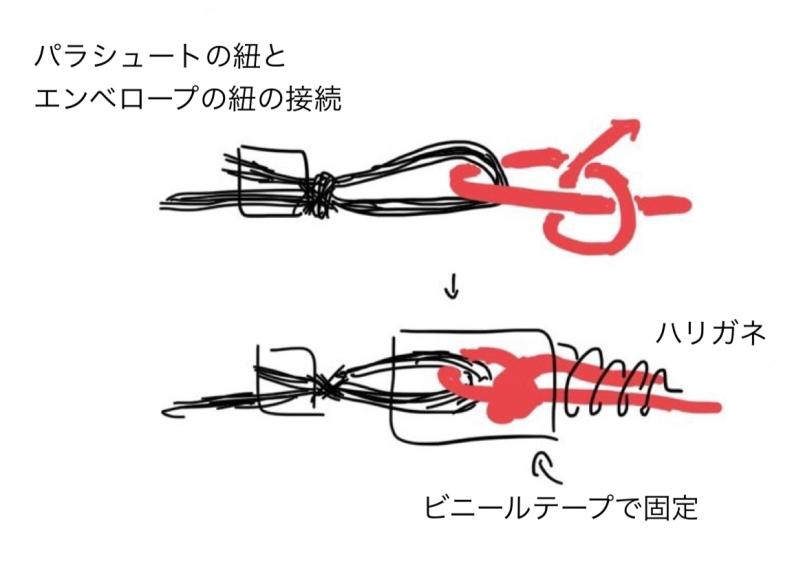
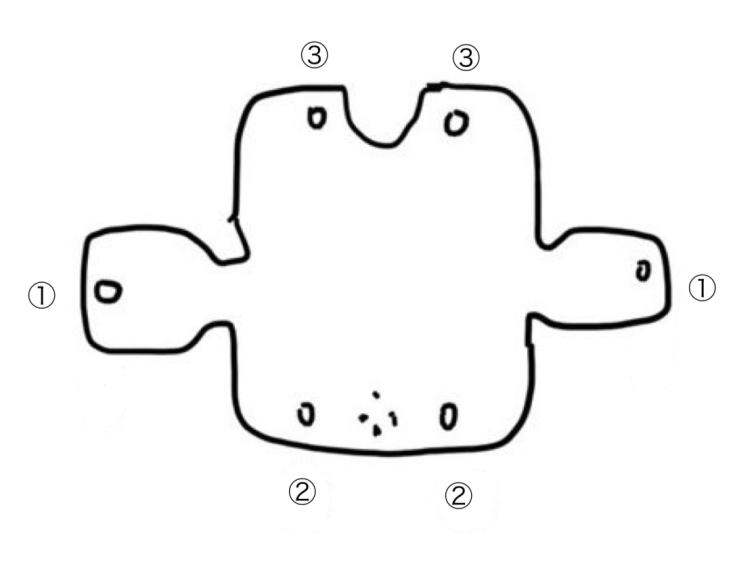
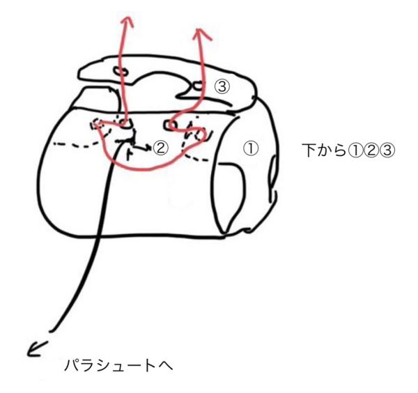

# Envelope
エンベロープの部品と設計図をまとめたディレクトリです.

## エンベロープの部品/材質
|使用する部品|使用する材質|サイズ|
|----|-----|------|
|エンベロープ|PPクラフトシート+アルミホイル+紙やすり+コンベックステープ+ハトメ|　|
|溶断用ひも|テグス|100mm|
|固定用ひも|ナイロン紐|直径3mm|
|その他|針金・ビニルテープ||

## エンベロープの概念図 
以下に設計図を記載する.  
  

## 素材の選び方
まず、PPクラフトシートについて、適度な反発力を持ち合わせていると考える.反発力がありすぎると、キャリア内部で変形し、上手く放出できないことがある.一方反発力が足りない場合、溶断したのちにCanSatがエンベロープから脱出できない恐れがある.  

また、エンベロープが開放により確実に開くようにエンベロープ内にコンベックステープをとりつけた.  

次に、紙やすりについて、タイヤが滑らないようにするためにエンベロープのタイヤが乗る部分に粗目の紙やすりをボンドで貼り付ける.  

  

次に、アルミホイルについて、ARLISS本番に点火のタイミングでプログラムが停止したため、ignitionのスイッチと発射台間の無線で何らかの電磁波が発生し障害となっていたと考え、エンベロープにアルミホイルテープを巻き電磁遮蔽を行った.  

  

最後に紐について、まずナイロン紐はエンベロープとパラシュートを接続するために用い、テグスは機体を覆うためにエンベロープを固定し、着地後に焼き切るための紐である.  

## 紐の結び方
### エンベロープとパラシュートの固定
以下に、エンベロープに接続する紐の結び方・パラシュートの紐とエンベロープの紐の接続について描いたものが以下の図である.  
なお、赤の線がエンベロープ側の紐で、黒の線がパラシュートの紐を表し、パラシュートの紐の結び方については[パラシュートの作成方法.md](Design-Data/Mechanic/Parachute/パラシュート作成方法.md)を確認していただきたい.  
また、ラインやパラシュート用のロープを通す穴に全てハトメを付けて強化した.
  
  

### エンベロープによるCanSatのカバー
また、エンベロープを円柱状に固定する際のテグスの結び方を以下に示す.  
一枚目のようにエンベロープの穴に番号を振る.  
なお、以下の写真二枚目の赤の線がテグスを表す.  
1. エンベロープ内側からタイヤ側面側の穴(①)にテグスを通す.テグスを穴に通す前に、テグス溶断用のニクロム線を通してから穴に通すようにすること.  
1. パラシュートの紐と接続している側の長辺の穴に通す.  
1. もう一方の辺に穴を通してテグスを結ぶ.なお、テグスは方結びで結ぶが、ほどけないように念入りに確認してほしい.  
  
  