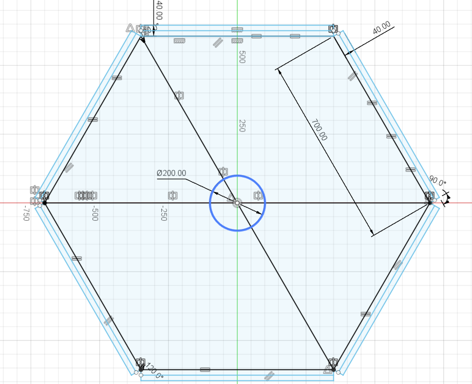
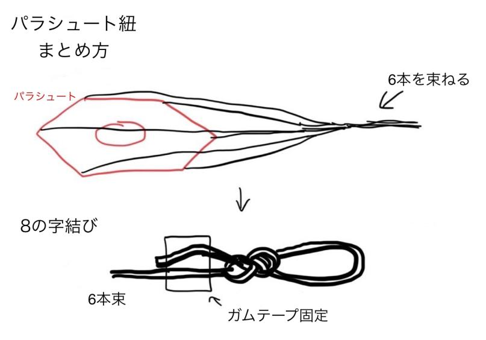

# Parachute
パラシュートの部品と設計図をまとめたディレクトリです.

## パラシュートの部品/材質
|使用する部品|使用する材質|サイズ|
|----|-----|------|
|パラフォイル|ナイロンタフタ/リップストップナイロン|1500mm四方|
|パラコード|ナイロン紐(テグス)|各700mm|
|ハトメ|真鍮製|直径8mm|

## パラシュートの設計図

## 製作行程
1. 青細線の通りに布を切り出す.
2. 黒線に一致するように正六角形の端の長方形を二回折り返して縫う.
3. 青太線の通りに中心を切り落とす.
4. 正六角形の各頂点にハトメにあったサイズの穴(8mm)を開け、ハトメで補強する.  

※パラシュートの中央部に穴を開けるのは、風に煽られて横流しにされるのを軽減するためである.穴が大きいほど風に流されにくくなるが、その分落下速度は上昇するため、注意が必要.

## 布の選び方
### 色
パラシュートの落下時や落下後に機体を捜索しやすくするため、視認性の高い色を採用する.  
例えば、空中にいるときに青系統の色は見つけにくいし、砂地であれば黄色に近い色は見えにくくなってしまう.  
したがって、2022年度ARLISSでは、赤色のパラシュートを作成した.
### 素材
傘に使われるナイロンタフタや、テント等のアウトドア用品に用いられるリップストップナイロンを強く勧める.  
軽量で破れにくいことや、パラシュートの減速機構としての能力を十分に発揮できる.

## 紐の選び方
### ナイロン紐にも複数の種類がある
- 金剛打ち
- 16打ち
- 8打ち
- テグス  
上から丈夫である一方重量が大きくなっている.
重量制限などを考慮して選択してほしい.  
ARLISS2022では、テグスを用いてパラコードを作成した.  
    金剛打ち  
      
    16打ち  
      
    8打ち  
      
    テグス  
      
    [参考紐](https://www.taisei-mfg.co.jp/lesson.html)  
    [参考テグス](https://tsuri-labo.jp/word/24268#google_vignette)
    
## 紐の結び方
### ハトメとパラシュートの結び方
1. ハトメにラインを2回通し,輪を作る.  
  
1. 本線にラインを4〜5回程度巻き付ける.  
  
1. ラインを1.で作った輪に通す.  
  
1. ゆっくりと締め込む.  
  
[参考](https://www.seaguar.ne.jp/knot/parts/parts_5.html)  
### パラシュートの紐のまとめ方
1. パラシュートのテグスを6本まとめる.  
1. 8の字結びしてガムテープで固定する.
  

## 畳み方
### パラコードを一つに集めるように畳む
1. パラコードが集まるように半分に4回折りたたむ
2. 半分に折りたたんで、その上に紐を折り曲げて置く
3. コードを一緒に包むようにして、もう一度半分に折りたたむ
4. さらに折りたたんで一回巻いて完成  

  
[参考](http://joujaku-pc-club.blog.jp/archives/5920767.html)