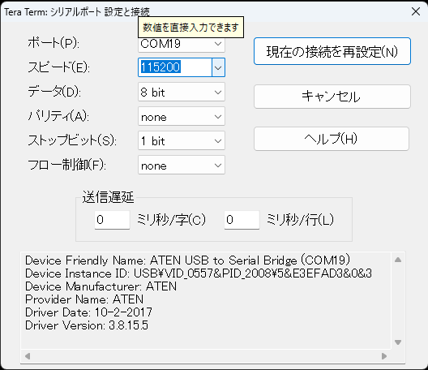

# Operations-Control

## 無線の受信についてのトラブルシューティング
機体を受け渡し後，ダウンリンクをとれない場合には以下のことを確認・実行をする．

1．TeraTerm上でbaurateの確認を行う．

TeraTermを開き，baurateの設定を確認する．

baurateは 設定>>シリアルポートを開き，以下のような画面で115200に設定する．

2．baurateを設定しなおしても動作しない場合はTeraTermの再起動を行う．

　一度Teratermを閉じたのち，１で説明したのと同じように再設定する．

3．それでも動作しない場合は，地上局側を再度設定しなおす必要がある．（設定については[Component/RM92Aを参照](Design-Data/Software/Component/RM92A)）
